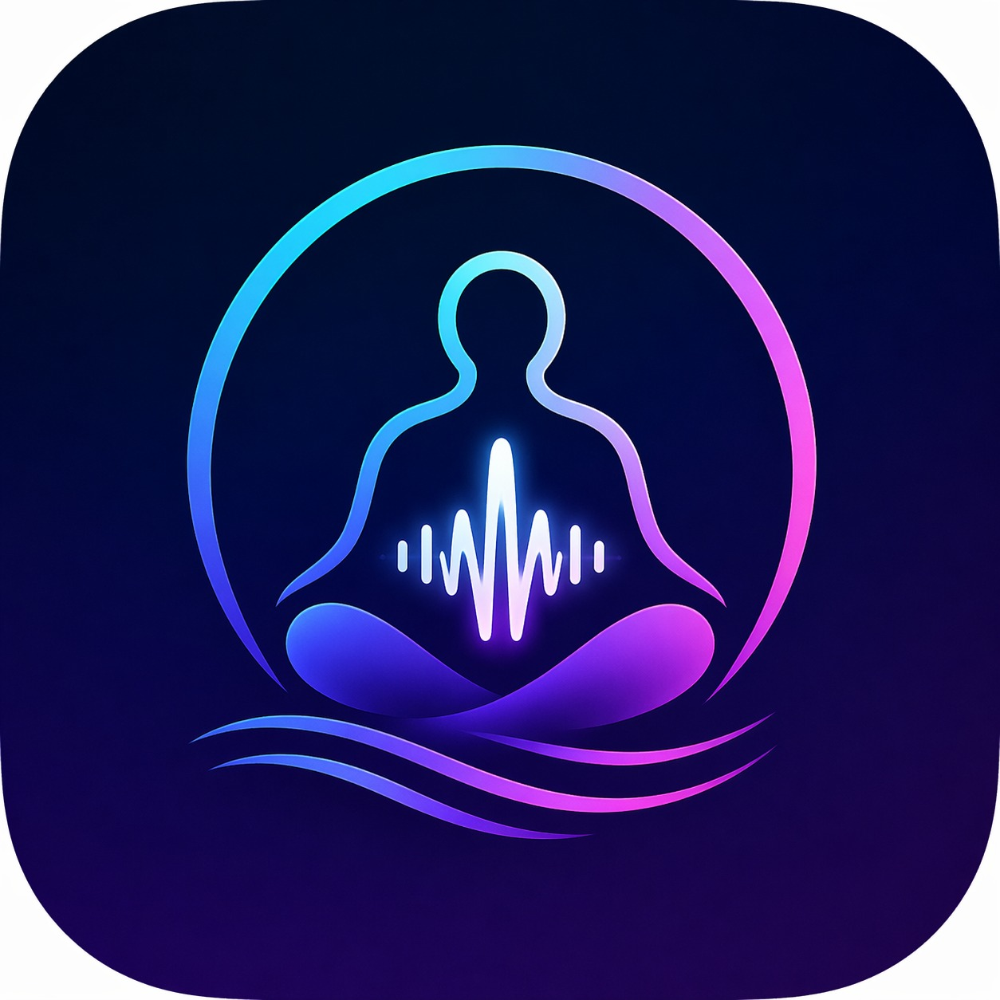

# 🎧 AuraTune

[](https://reactjs.org/)
[](https://www.typescriptlang.org/)
[](https://vitejs.dev/)
[](https://capacitorjs.com/)
[](LICENSE)

> ** scientifically-backed binaural beats & solfeggio frequencies for focus, sleep, meditation, and energy**

AuraTune is a modern, beautifully designed PWA that generates binaural beats and solfeggio frequencies in real-time using the Web Audio API. Built with React, TypeScript, and Capacitor for Android support.



---

## ✨ Features

### 🎵 Audio Engine
- **Real-time binaural beat generation** using Web Audio API (no pre-recorded files)
- **Mono-compatible layer** - Adds center oscillator for audible entrainment on mono speakers
- **Background nature sounds** - Rain, Ocean, Forest, Wind (procedurally generated)
- **Smart fade in/out** - 100ms envelopes prevent clicking
- **AudioContext keepalive** - Silent buffer prevents Android battery optimizer from suspending audio
- **Frequency compensation** - ISO 226:2003 equal-loudness contour boost for low frequencies

### 📱 App Features
- **15 scientifically tuned presets** - Beta, Alpha, Theta, Delta, Gamma & Solfeggio frequencies
- **5 categories** - Focus, Sleep, Meditation, Exercise, Relax
- **Mood-based recommendations** - Get personalized suggestions based on how you feel
- **Session tracking** - Automatic streak counting and listening statistics
- **Achievements system** - Gamified progress tracking
- **Background audio** - Continue playback with screen off (Android)
- **Timer with smart routines** - Pomodoro, Deep Work, Sleep Mode
- **Offline support** - PWA with service worker caching
- **Guest mode** - Use without account

### 🔐 Auth & Backend
- **Supabase Auth** - Email/password and Google OAuth
- **Row Level Security** - Secure data per user
- **Progressive sync** - Session data stored locally and synced when online

---

## 🚀 Quick Start

### Prerequisites
- Node.js 18+ 
- npm or bun

### Installation

```bash
# Clone the repository
git clone https://github.com/rdp12356/auratune.git
cd auratune

# Install dependencies
npm install

# Start development server
npm run dev
```

The app will be available at `http://localhost:8080`

### Environment Variables

Create a `.env` file:

```env
VITE_SUPABASE_URL=https://your-project.supabase.co
VITE_SUPABASE_PUBLISHABLE_KEY=your-publishable-key
```

---

## 📱 Building for Android

### Prerequisites
- Android Studio
- Android SDK (API 24+)
- Java 17

### Build Steps

```bash
# 1. Build the web app
npm run build

# 2. Sync with Capacitor
npx cap sync android

# 3. Open in Android Studio
npx cap open android

# 4. Build signed APK
# In Android Studio: Build > Generate Signed Bundle/APK
```

### Minimum Requirements
- **Android 7.0 (API 24)** or higher
- ~8MB storage
- Headphones recommended for binaural effect

---

## 🏗 Architecture

```
src/
├── components/          # React components
│   ├── ui/             # shadcn/ui components
│   ├── ErrorBoundary.tsx
│   ├── MiniPlayer.tsx
│   ├── BottomNav.tsx
│   └── ...
├── context/            # React Context providers
│   ├── PlayerContext.tsx      # Audio state management
│   ├── AuthContext.tsx        # Supabase auth
│   └── ThemeContext.tsx       # Dark/light mode
├── hooks/              # Custom React hooks
│   ├── useSessionTracker.ts   # Session recording
│   ├── useStats.ts            # Statistics
│   └── useFavorites.ts        # Favorites management
├── lib/                # Utilities
│   ├── audioEngine.ts         # Web Audio API
│   └── presets.ts             # Frequency definitions
├── pages/              # Screen components
│   ├── HomeScreen.tsx
│   ├── PlayerScreen.tsx
│   └── ...
├── integrations/       # External services
│   └── supabase/
└── test/               # Tests
```

---

## 🎼 Frequency Presets

| Name | Frequency | Category | Benefit |
|------|-----------|----------|---------|
| Deep Focus | 14Hz Beta | Focus | Enhances concentration |
| Flow State | 18Hz Beta | Focus | Activates creative thinking |
| Deep Sleep | 4Hz Delta | Sleep | Physical recovery |
| 528Hz Love | 7Hz Solfeggio | Meditation | Cellular harmony |
| Cardio Boost | 20Hz Beta | Exercise | Elevates heart rate |
| 432Hz Harmony | 6Hz Solfeggio | Relax | Natural alignment |

*...and 9 more presets*

---

## 🛠 Tech Stack

| Category | Technology |
|----------|------------|
| **Framework** | React 18 + Vite |
| **Language** | TypeScript 5.8 |
| **Styling** | Tailwind CSS + CSS Variables |
| **UI Components** | Radix UI + shadcn/ui |
| **Animations** | Framer Motion |
| **State** | React Context + TanStack Query |
| **Mobile** | Capacitor 8 |
| **Backend** | Supabase (Auth + PostgreSQL) |
| **Audio** | Web Audio API |
| **Icons** | Lucide React |

---

## 📊 Project Stats

- **Lines of Code**: ~3,500
- **Components**: 45+
- **Test Coverage**: Unit + E2E (Playwright)
- **Bundle Size**: ~500KB (gzipped)
- **APK Size**: 7.9MB

---

## 🔮 Roadmap & Suggested Features

### Phase 1: Audio Enhancements
- [ ] **Custom frequency builder** - User-defined carrier/beat frequencies
- [ ] **Multi-layer mixing** - Combine multiple frequencies simultaneously
- [ ] **Volume automation** - Gradual fade-out for sleep sessions
- [ ] **Export sessions** - Save audio as WAV/MP3

### Phase 2: Health Integration
- [ ] **Heart rate sync** - Connect with fitness trackers
- [ ] **Sleep tracking** - Integration with Google Fit/Apple Health
- [ ] **Smart scheduling** - Auto-play based on calendar events
- [ ] **Breathing exercises** - Guided box breathing with audio cues

### Phase 3: Social & AI
- [ ] **Community presets** - Share custom frequencies
- [ ] **AI recommendations** - ML-based suggestions from usage patterns
- [ ] **Group sessions** - Synchronized listening rooms
- [ ] **Voice commands** - "Hey Google, play Deep Focus"

### Phase 4: Enterprise
- [ ] **Team analytics** - Workplace productivity insights
- [ ] **White-label** - Custom branding for therapists
- [ ] **Offline SDK** - Embed audio engine in other apps

---

## 🤝 Contributing

1. Fork the repository
2. Create a feature branch (`git checkout -b feature/amazing-feature`)
3. Commit changes (`git commit -m 'Add amazing feature'`)
4. Push to branch (`git push origin feature/amazing-feature`)
5. Open a Pull Request

---

## 📄 License

Distributed under the MIT License. See `LICENSE` for details.

---

## 🙏 Acknowledgments

- [Web Audio API](https://developer.mozilla.org/en-US/docs/Web/API/Web_Audio_API) for real-time synthesis
- [Capacitor](https://capacitorjs.com/) for native mobile bridge
- [shadcn/ui](https://ui.shadcn.com/) for beautiful components
- [Supabase](https://supabase.com/) for backend infrastructure

---

<p align="center">Made with 💜 and binaural beats</p>
